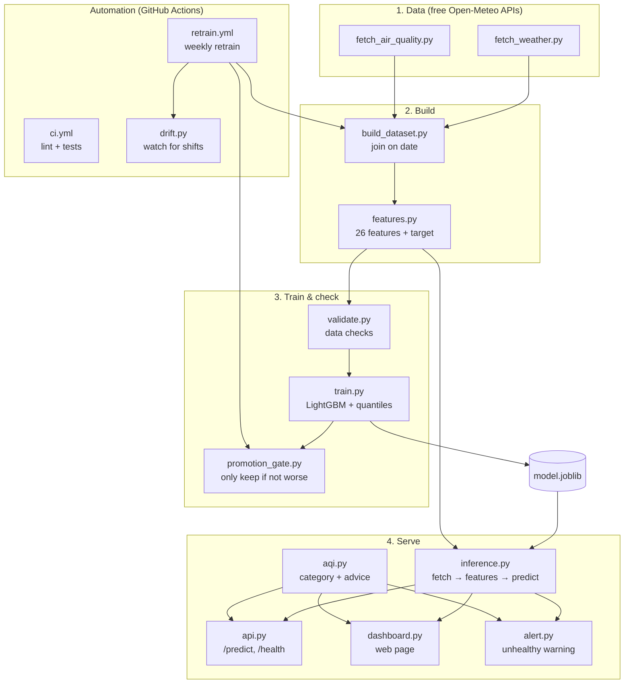

# Architecture

How the pieces fit together, from raw data to the forecast you see on the web.

## The big picture

## In words

1. **Data** — two small fetchers pull daily weather and hourly air quality from
   the free Open-Meteo APIs.
2. **Build** — `build_dataset.py` joins them by date; `features.py` turns the raw
   table into 26 features (lags, rolling stats, calendar) plus the target
   (tomorrow's PM2.5). This same feature code is used everywhere, so training and
   serving always agree.
3. **Train & check** — `validate.py` blocks bad data, `train.py` fits the
   LightGBM model (plus quantile models for the low/high range), and
   `promotion_gate.py` refuses to keep a model that got worse.
4. **Serve** — `inference.py` is the one shared "predict tomorrow" path. The API
   (`api.py`) and the web page (`dashboard.py`) both call it. `aqi.py` adds a
   health category, and `alert.py` warns when the air will be unhealthy.
5. **Automation** — GitHub Actions runs the tests on every push and retrains the
   model weekly, with drift checks and the quality gate protecting it.

## Key design choice

**One feature file, used by both training and serving.** This is the most
important idea in the codebase. Because `features.py` is the single source of
truth, the model can never be trained on one set of columns and served a
different set — a common and hard-to-spot bug in ML systems.
