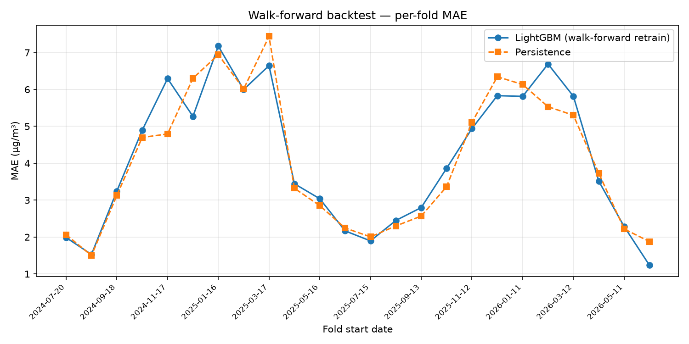

# Walk-forward backtest

Retrain-and-forecast replay over 2023-07-20 → 2026-06-12: first train on 365 days, then repeatedly forecast the next 30 days and roll forward — **24 refits**, 693 out-of-sample predictions in total.

## Pooled out-of-sample metrics

| Model | MAE | RMSE |
|---|---:|---:|
| Persistence | 4.159 | 5.904 |
| Seasonal-naive | 7.533 | 9.940 |
| **LightGBM** | **4.229** | **5.817** |

- Improvement vs persistence: **-1.7% MAE**
- Improvement vs seasonal-naive: **+43.9% MAE**
- Folds where the model beat persistence: **11 / 24**

## Per-fold detail

| Fold | Test window | Train rows | Model MAE | Persistence MAE | Seasonal MAE |
|---:|---|---:|---:|---:|---:|
| 1 | 2024-07-20 → 2024-08-18 | 366 | 1.985 | 2.063 | 3.711 |
| 2 | 2024-08-19 → 2024-09-17 | 396 | 1.528 | 1.499 | 2.732 |
| 3 | 2024-09-18 → 2024-10-17 | 426 | 3.246 | 3.126 | 5.068 |
| 4 | 2024-10-18 → 2024-11-16 | 456 | 4.894 | 4.699 | 6.292 |
| 5 | 2024-11-17 → 2024-12-16 | 486 | 6.295 | 4.793 | 12.983 |
| 6 | 2024-12-17 → 2025-01-15 | 516 | 5.269 | 6.302 | 9.013 |
| 7 | 2025-01-16 → 2025-02-14 | 546 | 7.176 | 6.942 | 9.519 |
| 8 | 2025-02-15 → 2025-03-16 | 576 | 5.997 | 6.015 | 9.794 |
| 9 | 2025-03-17 → 2025-04-15 | 606 | 6.646 | 7.436 | 12.263 |
| 10 | 2025-04-16 → 2025-05-15 | 636 | 3.444 | 3.321 | 8.192 |
| 11 | 2025-05-16 → 2025-06-14 | 666 | 3.038 | 2.851 | 7.409 |
| 12 | 2025-06-15 → 2025-07-14 | 696 | 2.166 | 2.244 | 3.648 |
| 13 | 2025-07-15 → 2025-08-13 | 726 | 1.895 | 2.004 | 4.080 |
| 14 | 2025-08-14 → 2025-09-12 | 756 | 2.449 | 2.300 | 5.918 |
| 15 | 2025-09-13 → 2025-10-12 | 786 | 2.798 | 2.568 | 4.967 |
| 16 | 2025-10-13 → 2025-11-11 | 816 | 3.861 | 3.363 | 7.405 |
| 17 | 2025-11-12 → 2025-12-11 | 846 | 4.941 | 5.106 | 12.945 |
| 18 | 2025-12-12 → 2026-01-10 | 876 | 5.831 | 6.344 | 8.436 |
| 19 | 2026-01-11 → 2026-02-09 | 906 | 5.812 | 6.134 | 10.961 |
| 20 | 2026-02-10 → 2026-03-11 | 936 | 6.688 | 5.532 | 11.890 |
| 21 | 2026-03-12 → 2026-04-10 | 966 | 5.815 | 5.301 | 7.095 |
| 22 | 2026-04-11 → 2026-05-10 | 996 | 3.515 | 3.730 | 6.213 |
| 23 | 2026-05-11 → 2026-06-09 | 1026 | 2.285 | 2.218 | 3.336 |
| 24 | 2026-06-10 → 2026-06-12 | 1056 | 1.233 | 1.876 | 1.324 |
