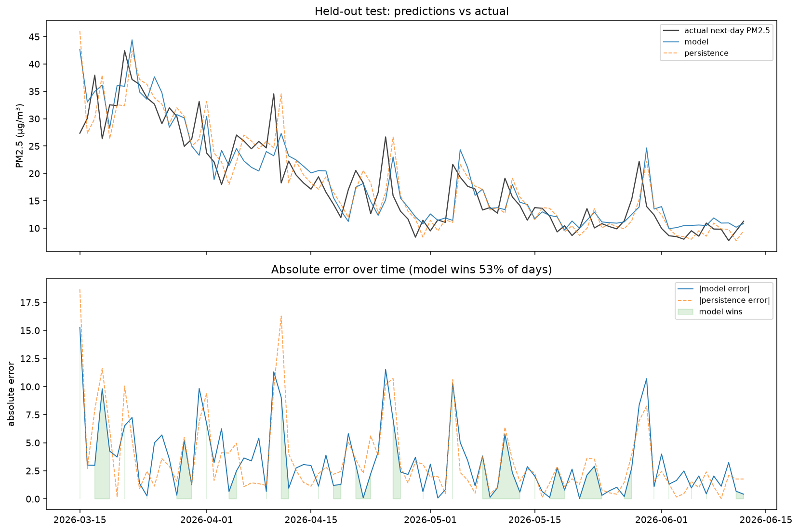
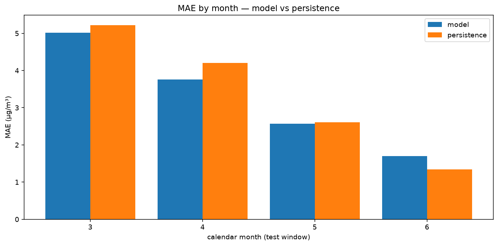
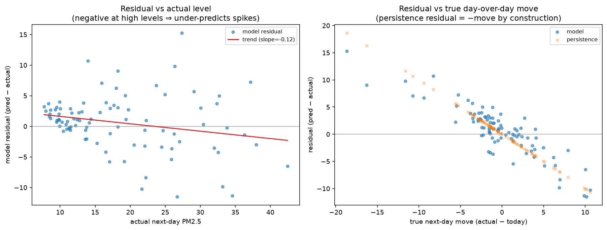

# Phase 6.1 — Error Analysis: where the model loses to persistence

**Test window:** 2026-03-15 → 2026-06-12 (90 days)  
**Model MAE:** 3.312  ·  **Persistence MAE:** 3.467  ·  **Model wins on 53% of days**

## Why persistence is so hard to beat

The daily PM2.5 series has lag-1 autocorrelation ≈ 0.83: today's value is by far the best single predictor of tomorrow's. Persistence encodes exactly that, so the *only* headroom above persistence is in correctly anticipating the **day-over-day move** — which is close to noise for a daily-mean series.

## Split by regime

| Regime | Model MAE | Persistence MAE |
|---|---:|---:|
| Calm days (small true move, bottom 75%) | 2.058 | 1.842 |
| Big-move days (top 25% of \|true move\|) | 6.966 | 8.202 |

On calm days the two are near-identical (both essentially copy today). The model's edge, such as it is, comes on big-move days — but that is also where absolute errors are largest and hardest to nail.

## Bias at high pollution levels

Mean model residual on high-PM2.5 days (top quartile of actual): **-0.43 µg/m³**. A negative value confirms the model **under-predicts spikes** — it regresses sharp peaks toward the recent mean, the classic smoothing behaviour of a tree ensemble trained on MAE.

## Takeaways for 6.2–6.5

1. Headroom is concentrated in *big-move* days; features that hint at an imminent change (wind shift, pressure change, precipitation) are the only plausible lever. Calendar/rolling features mostly help persistence-like calm days where there's little to gain.
2. The under-prediction of spikes argues for **quantile / interval** outputs (6.5): even if the point forecast can't nail a spike, an upper band can flag the risk.
3. A large point-MAE win over persistence is unlikely to be real; the honest bar is a *small but consistent* improvement plus useful uncertainty — which is what the rest of Phase 6 targets.

