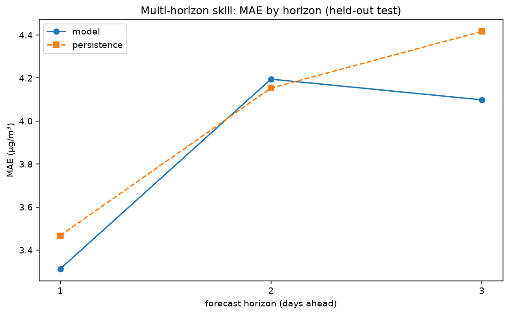

# Phase 6.6 — Multi-horizon forecasts (+1 / +2 / +3 days)

Direct strategy: one LightGBM per horizon, each predicting PM2.5 *h* days ahead from the day-*t* features (`make_features`, unchanged). Same held-out test window; persistence baseline = today's value carried *h* days forward.

| Horizon | Model MAE | Persistence MAE | Improvement |
|---|---:|---:|---:|
| +1 day | 3.312 | 3.467 | +4.5% |
| +2 day | 4.195 | 4.153 | -1.0% |
| +3 day | 4.099 | 4.417 | +7.2% |

Both the model and persistence lose accuracy as the horizon grows (today's value ages), and the model's edge over persistence is small and **noisy** across horizons rather than a clean trend — consistent with the 6.4 finding that the predictable signal beyond persistence is thin. The direct strategy extends cleanly with no feature-builder changes, so this is a ready foundation if longer-horizon serving is ever needed; for now the API/dashboard ship the calibrated next-day forecast + interval.

