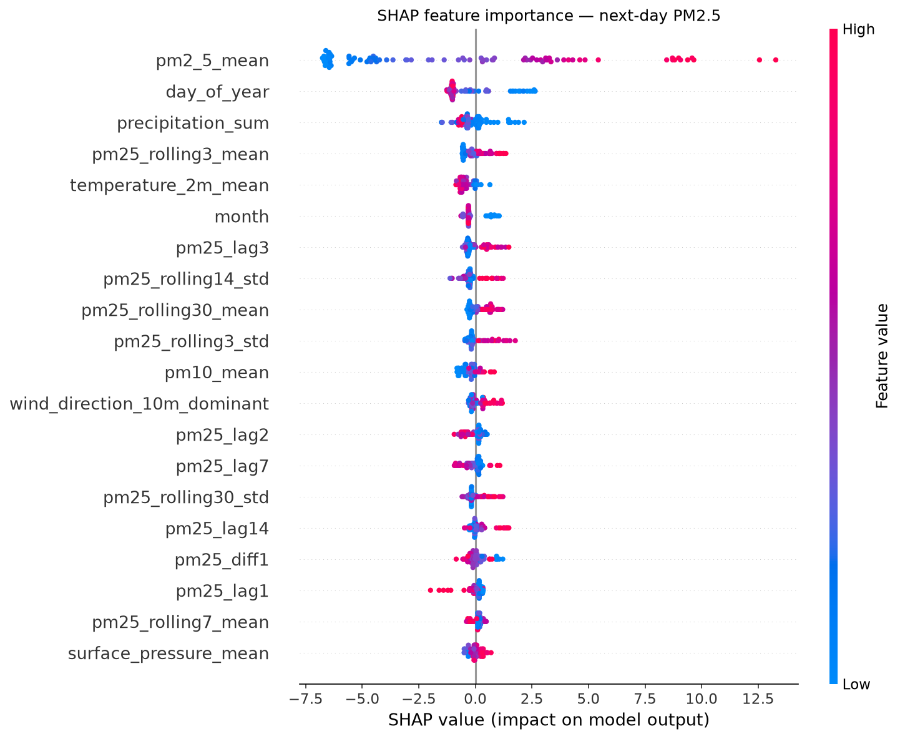

# PM2.5 Next-Day Forecast — Results

**Target:** `pm25_next_day` (next-day mean PM2.5, μg/m³)  
**Data:** 1059 supervised rows (2023-07-20 → 2026-06-12), 26 features  
**Validation:** TimeSeriesSplit expanding window, 5 folds (train pool only)  
**Final test (held out, untouched):** 90 days (2026-03-15 → 2026-06-12)

## Headline

| Model | MAE | RMSE |
|---|---:|---:|
| Persistence (today → tomorrow) | 3.467 | 4.900 |
| Seasonal-naive (same weekday last week) | 5.427 | 6.962 |
| **LightGBM** | **3.312** | **4.532** |

## Improvement of LightGBM over baselines

| Baseline | MAE improvement | RMSE improvement |
|---|---:|---:|
| vs persistence | +4.5% | +7.5% |
| vs seasonal-naive | +39.0% | +34.9% |

_(Positive = the model reduces the baseline's error.)_

## Prediction intervals (quantile LightGBM)

Alongside the point forecast we ship quantile models at p10, p50, p90 (LightGBM `objective="quantile"`), giving a 80% central band.

| Metric | Value |
|---|---:|
| Nominal coverage | 80% |
| Empirical coverage (held-out test) | 80.0% |
| Mean interval width | 13.02 µg/m³ |
| Pinball loss @ p10 | 0.592 |
| Pinball loss @ p50 | 1.527 |
| Pinball loss @ p90 | 1.003 |

_Empirical coverage near the nominal level means the band is well-calibrated; the API and dashboard surface this range so users see forecast uncertainty, not just a point._

## Cross-validation (train pool only)

TimeSeriesSplit expanding window, 5 folds (train pool only):

- MAE  = 5.002 ± 2.224
- RMSE = 6.521 ± 2.827

## Method notes (honesty / leakage)

- **No shuffling, no random split.** Train/test are split strictly by date; the most recent ~3 months were untouched during model development.
- **Leakage-safe features.** Every feature for day *t* uses only information available up to day *t* (lags `shift(k≥1)`, non-centred rolling windows). The only future-looking column is the target.
- **Same feature function at train and inference.** Features come from `src.features.make_features`, so production inputs match training inputs.
- **Single test evaluation.** The held-out test set was scored once, after model selection on the train pool — no test-set tuning.

